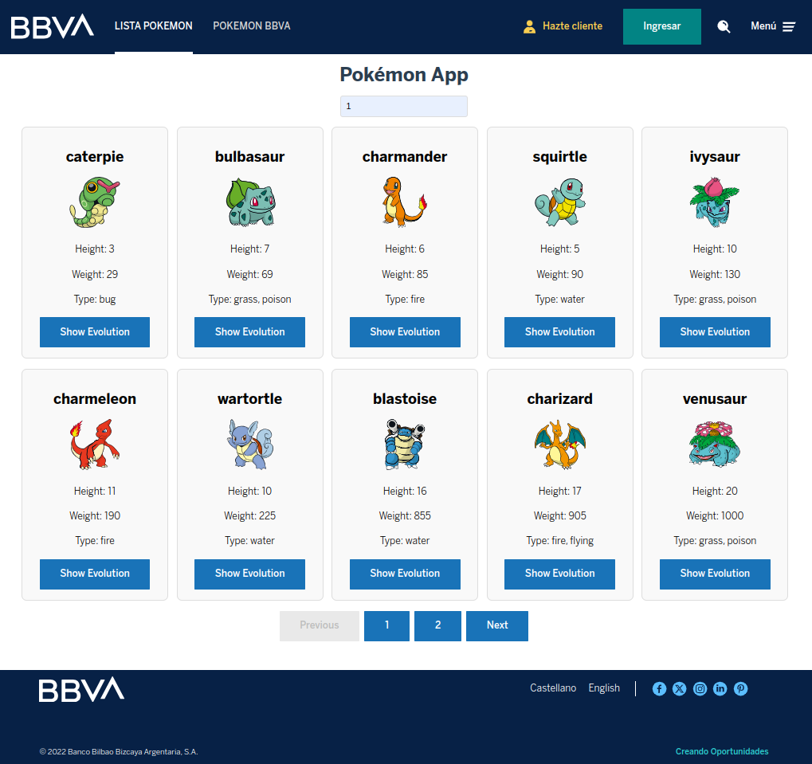
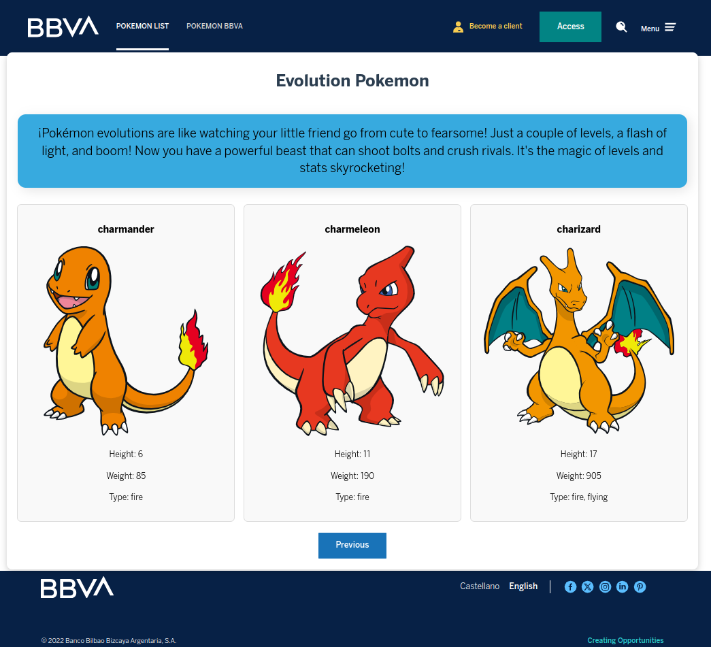
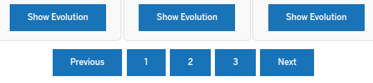
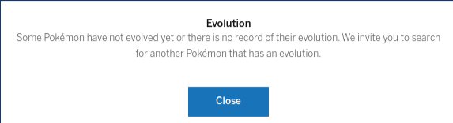

# Pokémon Workshop Using the Cells Platform

## Project Description

This project focuses on creating an interactive workshop about Pokémon using the Cells platform. Through this workshop, we aim to implement various components designed specifically to explore the world of Pokémon, providing participants with an engaging and educational experience.

### Workshop Objectives

- **Learn to Use the Cells Platform**: Understand the core features and functionalities of the Cells platform.
- **Create DM and UI Components**: Develop components using Lit-Component for both data modeling and user interface design.
- **Implement Page Routing**: Set up routing for different pages within the application to enhance navigation.
- **Conduct Unit Testing**: Perform unit tests on the DM components to ensure reliability and performance.

### Project Components

- **Data Model Components**: Elements that handle data structures and business logic.
- **User Interface Components**: Visual elements that facilitate user interaction.
- **Routing Setup**: Configuration of routes to navigate between different views/pages.
- **Unit Tests**: Automated tests to verify the functionality of DM components.


## What has it got?

- It showcases the minimal sample application built with [LitElement](https://lit.dev/) and declarative pages, using our latest stack (Cells Cli 4.0 & Cells Bridge).

- Built entirely with components from [Cells Catalog](https://au-bbva-andromeda.appspot.com/api/projects/au-bbva-cells-platform/segments/au-bbva-cells-artefacts/resources/cells/apps/bbva_gl_catalog/cells-catalog/master/cellsapp/pr/vulcanize/index.html#!/) - BBVA Experience & Cells Architecture.


# CELLS (**cells-cli**)

**cells-cli** is the command line tool that provides you with common tasks and commands for working in a cells project.

## Installation

To install the application just run:

~~~sh
npm -g install @cells/cells-cli
~~~

Once installed, `cells` command will be available to you.

## Usage

* Starting the application in dev mode

~~~
$ cells app:serve -c dev.js
~~~

* Starting the application in production mode

~~~
$ cells app:serve -c dev.js -b
~~~
---
## APP-POKEMON

APP-Pokémon is an application built on the Cells platform by BBVA that aims to list Pokémon in the form of cards. This application will showcase Pokémon along with their evolution stages, utilize catalogs from BBVA, and leverage the UI and DM components created with Lit-Component.

### Objectives of the Application

- **List Pokémon**: Display Pokémon in a visually appealing card format for easy browsing.
- **Show Evolution Stages**: Provide information about each Pokémon's evolution stages to enhance the user experience.
- **Utilize BBVA Catalogs**: Integrate and utilize catalogs from BBVA to enrich the Pokémon listing experience.
- **Implement UI and DM Components**: Use Lit-Component to create reusable and interactive UI and DM components for the application.

APP-Pokémon seeks to provide a fun and engaging way to explore the world of Pokémon through the power of the Cells platform and the innovative solutions offered by BBVA!

### Pokemon-page
The **pokemon-page** component displays a series of Pokémon cards, each featuring the key characteristics of the Pokémon. Users can easily browse through various Pokémon, each represented with essential information, including:



### evolution-pokemon
In a separate line, clicking on **"Show Evolution"** will open a container displaying the evolution stages of the selected Pokémon, along with additional information.



## Integration Examples

This README provides comprehensive HTML examples that demonstrate how to seamlessly integrate the `app-pokemon` component into an HTML application. These examples showcase the configured events and properties that enhance the component's functionality, allowing for a more interactive and dynamic user experience.

By following these examples, you will learn how to:

- Properly include the `app-pokemon` component within your HTML structure.
- Configure events to handle user interactions effectively.
- Utilize properties to customize the component's behavior and appearance.

These practical demonstrations will guide you through the implementation process, ensuring you can fully leverage the capabilities of the `app-pokemon` component in your application.

```js
import { AppPokemon } from '@meraki/app-pokemon';

```

```html
  <demo-web-template page-title="Pokémon App">
       <div slot="app-top-content">
       ${this._headerTpl}
       </div>

       <div slot="app-main-content" class="app-mains">
       <app-pokemon></app-pokemon>
      </div>

       <div slot="app-top-content" data-grid="full-width">
          ${this._footerTpl}
        </div>
       
     </demo-web-template> 

```


---
### Internationalization

This application utilizes internationalization (i18n) to support multiple languages. In this example, two languages are used: Spanish and English. As observed in the header and footer, the application accommodates users by providing content in both languages, ensuring a more inclusive experience.
Here’s an example of the i18n configuration:

```json
{
  "en": {
    "login-page.footer-claim": "Creating Opportunities",
    "login-page.menu-access": "Access",
    "login-page.menu-register": "Become a customer",
    "login-page.menu-tab-1": "Pokemon List",
    "login-page.menu-tab-2": "Pokemon BBVA"
  },
  "es": {
    "login-page.footer-claim": "Creando Oportunidades",
    "login-page.menu-access": "Ingresar",
    "login-page.menu-register": "Hazte cliente",
    "login-page.menu-tab-1": "Lista Pokemon", 
    "login-page.menu-tab-2": "Pokemon BBVA" 
  }
}
```
---
### BBVA Usage Component

The BBVA usage components are designed to facilitate seamless interactions within web applications. Each component serves a specific purpose, enhancing user experience and functionality.

- **bbva-web-button-default**: A customizable button component that provides users with a consistent and visually appealing interface for performing actions throughout the application. It supports various states (default, hover, active) and can be easily styled to match the application's branding.




- **bbva-progress-content**: This component displays progress indicators for ongoing tasks, allowing users to visualize the completion status of processes such as uploads, downloads, or any time-consuming actions. It improves user engagement by providing feedback during long-running operations.


- **bbva-help-modal**: A modal dialog that offers contextual help and guidance to users. This component can display FAQs, tips, or detailed instructions to assist users in navigating the application effectively. It enhances usability by ensuring that help is readily available when needed.



---

This README provides a comprehensive overview of the Pokémon Workshop project developed on the Cells platform. It covers the project objectives, key components, and practical integration examples of the app-pokemon component. By exploring this document, participants can gain valuable insights into building an engaging Pokémon application, complete with internationalization support and various BBVA usage components designed to enhance user experience.


